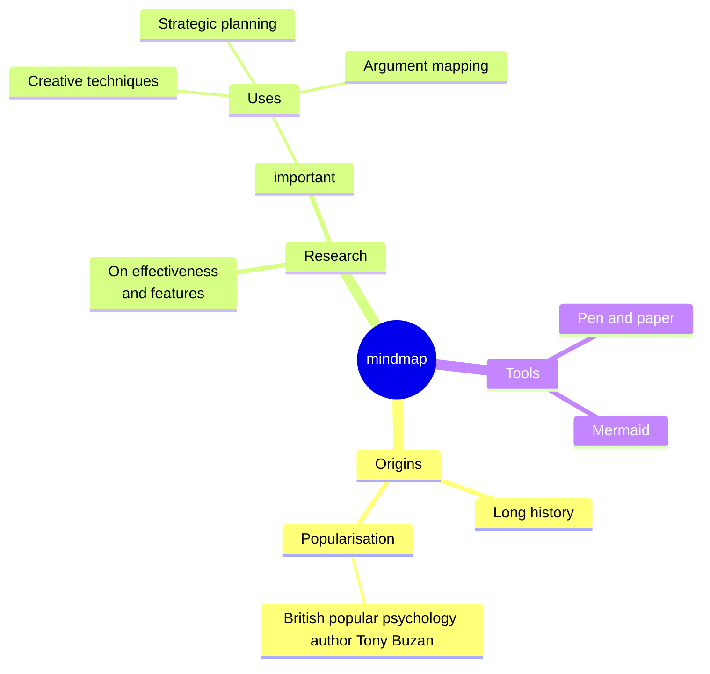

# Journey [under construction]

.........

[2025](#2025) | [2024](#2025) | [2023](#2023) | [2022](#2022) | [2021](#2021) | [2020](#2020) | [2019](#2019) | [2018](#2018) | [2017](#2017)

+ ## 2025

 + Name - Description
 + Name - Description
 + Name - Description

+ ## 2024

 + Name - Description
 + Name - Description
 + Name - Description

+ ## 2023

+ ## 2022

+ ## 2021

+ ## 2020

+ ## 2019

+ ## 2018

+ ## 2017
