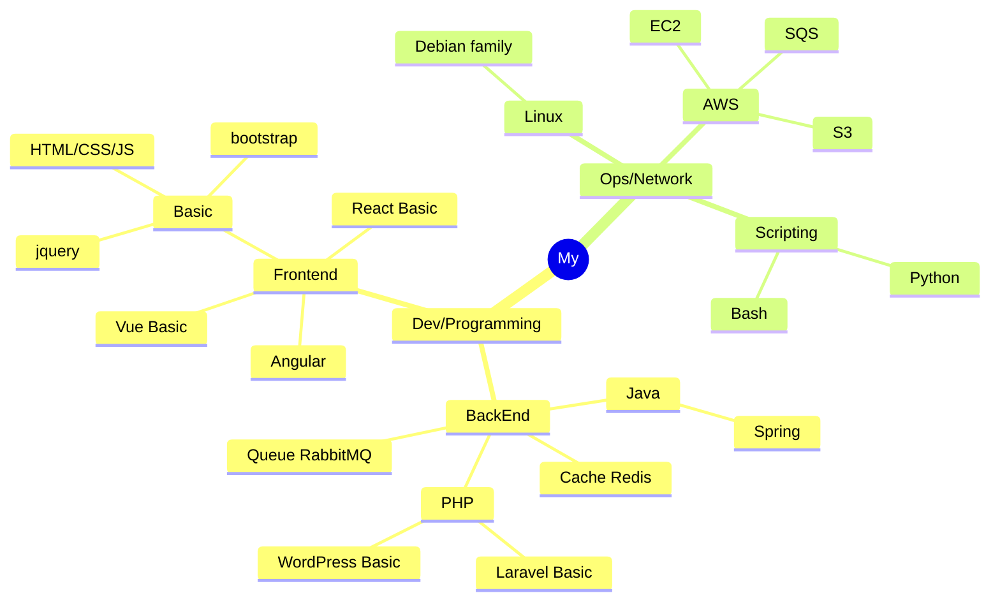

# Journey [under construction]

[2025](#2025) | [2024](#2024) | [2023](#2023) | [2022](#2022) | [2021](#2021) | [2020](#2020) | [2019](#2019) | [2018](#2018) | [2017](#2017) 

<!-- -->


<!-- -->

## 2025

<!--```mermaid
graph TD
    A[This is an <b>important</b> <a href='https://google.com'>link</a>]
```-->

<!--  + Professional Experience:-->
<!--  + My Contributions:-->

 + Activities:
    - [**Challenge BackEnd Anotai**](https://github.com/gilberto-009199/desafio-anotai-backend-aws) - API for a product catalog management system in a marketplace application with S3 and SQS for catalog;
        <br/><small>
                <!-- <strong> Spring Boot</strong> -->
                <strong> Spring Boot</strong>
                <!-- <strong> Docker</strong> -->
                <strong> Docker</strong>
                <strong> Swagger</strong>
                <strong> MongoDB</strong>
                <strong> AWS</strong>
                <strong> S3 Bucket</strong>
                <strong> SQS </strong>
                <strong> Terraform</strong>
              </small>
    - [**Challenge BackEnd UolHost**](https://github.com/gilberto-009199/desafio-uolhost-backend) - Java application capable of retrieving information from an XML file and a JSON file;
        <br/><small>
                <!-- <strong> Spring Boot</strong> -->
                <strong> Spring Boot</strong>
                <!-- <strong> Docker</strong> -->
                <strong> Docker</strong>
                <strong> Bootstrap</strong> 
              </small>
    - [**Challenge BackEnd Itau**](https://github.com/gilberto-009199/desafio-itau-backend) - REST API that receives Transactions and returns Statistics on those transactions;
        <br/><small>
                <!-- <strong> Spring Boot</strong> -->
                <strong> Spring Boot</strong>
                <!-- <strong> Docker</strong> -->
                <strong> Docker</strong>
                <strong> Swagger</strong>
              </small>

## 2024

<!--```mermaid
mindmap
  root((mindmap))
    Origins
      Long history
      ::icon(fa fa-book)
      Popularisation
        British popular psychology author Tony Buzan
    Research
      On effectiveness<br/>and features
      important
        Uses
            Creative techniques
            Strategic planning
            Argument mapping
    Tools
      Pen and paper
      Mermaid
```-->
<!---+ Professional Experience:-->
<!---+ My Contributions:-->


 + Activities:
    - [**Challenge BackEnd PicPay**](https://github.com/gilberto-009199/picpay-desafio-backend) - Simplified payment platform. It allows you to deposit and transfer money between users
    <br/><small>
            <!-- <strong> Spring Boot</strong> -->
            <strong> Spring Boot</strong>
            <!-- <strong> Docker</strong> -->
            <strong> Docker</strong>
            <strong> Swagger</strong>
            <strong> Kafka</strong>
          </small>

    - [**BigData**](https://github.com/gilberto-009199/bigdata) - BigData and MapReduce
      <br/><small>
            <strong> Scala</strong>
            <strong> Java</strong>
            <!-- <strong> Docker</strong> -->
            <strong> Docker</strong>
            <strong> Hadoop</strong>
            <strong> MongoDB</strong>
            <strong> PostgreSQL</strong>
          </small>

<!-- add https://github.com/gilberto-009199/processamento_imagem -->

## 2023

<!--  + Professional Experience:-->
<!--  + My Contributions: -->

 + Activities:
    - [**Challenge BackEnd Athornatus**](https://github.com/gilberto-009199/desafio-athornatus-backend) - Using Spring boot, create a simple API to manage People;
    <br/><small>
            <!-- <strong> Spring Boot</strong> -->
            <strong> Spring Boot</strong>
            <!-- <strong> Docker</strong> -->
            <strong> Docker</strong>
            <strong> Swagger</strong>
            <strong> Lombok</strong>
          </small>
   - [**Library in JSF**](https://github.com/gilberto-009199/bibliotecaJSF) - The objective of this application is to serve as a basis for studying and evaluating the development;
    <br/><small>
            <!-- <strong> Docker</strong> -->
            <strong> Docker</strong>
            <strong> Java</strong>
            <strong> Lombok</strong>
            <strong> Tomcat</strong>
            <strong> JSF</strong>
            <strong> PostgreSQL</strong>
          </small>
   - [**Manager OTP**](https://github.com/gilberto-009199/myauth) - MyAuth, manager token OTP and HOTP, Usando Golang, React e Wails.
    <br/><small>
            <strong> Wails</strong>
            <strong> Go</strong>
            <strong> React</strong>
          </small>
   
    - [**Backend Example**](https://github.com/Javeiros-brasil/helpmatch-backend) - SpringBoot basic example;
    <br/><small>
            <!-- <strong> Spring Boot</strong> -->
            <strong> Spring Boot</strong>
            <strong> PostgreSQL</strong>
            <strong> Lombok</strong>
          </small>

<!-- add https://github.com/gilberto-009199/terra-invicta-traducao -->

## 2022

<!--  + Professional Experience:-->
<!--  + My Contributions: -->

 + Activities:
    - [**Challenge FullStack Jara**](https://github.com/gilberto-009199/avaliacao-full-stack) - Angular Application with SpringBoot;
    <br/><small>
            <!-- <strong> Spring Boot</strong> -->
            <strong> Spring Boot</strong>
            <!-- <strong> Docker</strong> -->
            <strong> Docker</strong>
            <!--<strong> Angular</strong>-->
            <strong> Angular</strong>
            <!-- <strong> PrimeNG</strong> -->
            <strong> PrimeNG</strong>
            <!-- <strong> Lombok</strong> -->
            <strong> Lombok</strong>
          </small>

<!-- add https://github.com/gilberto-009199/music -->
<!-- add https://github.com/gilberto-009199/bencode -->
<!-- add https://github.com/gilberto-009199/Estrutura-de-Dados -->


## 2021

<!--  + Professional Experience:-->
<!--  + My Contributions: -->

 + Activities:
   - [**Login Cryto Wallet Vue**](https://github.com/gilberto-009199/Login-Cripto-Wallet-Vue) - Login Cryto Wallet Vue;
    <br/><small>
            <!-- <strong> Docker</strong> -->
            <strong> Docker</strong>
            <strong> MetaMask</strong>
            <strong> VUE</strong>
          </small>
   - [**Site of AspenFlorest**](https://github.com/gilberto-009199/AspenX) - AspenX site cryptocurrency.
    <br/><small>
            <!-- <strong> Docker</strong> -->
            <strong> Docker</strong>
            <strong> Bootstrap</strong>
            <strong> JQuery</strong>
          </small>

## 2020

<!--  + Professional Experience:-->
<!--  + My Contributions: -->
 + Activities:
   - [**Contact Book in JSP**](https://github.com/gilberto-009199/JAgendaWeb) - Web contact book made with JSP, Bootstrap and Jquery;
    <br/><small>
            <!-- <strong> Docker</strong> -->
            <strong> Docker</strong>
            <strong> Servlets</strong>
            <strong> Tomcat</strong>
            <strong> Bootstrap</strong>
            <strong> JQuery</strong>
          </small>
   
   - [**My Script for bot in Screeps**](https://github.com/gilberto-009199/MyScreeps) - Code for manager Bot Screeps Game;
    <br/><small>
            <strong> JavaScript</strong>
          </small>
   - [**Http Server in C++**](https://github.com/gilberto-009199/http-server-cpp) - Http server implemented in C++;
    <br/><small>
            <strong> C++</strong>
          </small>
          
   - [**Game in java**](https://github.com/gilberto-009199/mondoj) - Game 3d basic in LibGDX
    <br/><small>
            <strong> Java</strong>
            <strong></strong>
          </small>

## 2019

<!--  + Professional Experience:-->
<!--  + My Contributions: -->
 + Activities:
   - [**Mobshare TCC PHP**](https://github.com/gilberto-009199/mobshare) - Mobshare tcc Site for developer SENAI.
    <br/><small>
            <strong> PHP</strong>
            <!-- <strong> Docker</strong> -->
            <strong> Docker</strong>
            <strong> MariaDB</strong>
            <strong> JQuery</strong>
          </small>
   - [**Mobshare TCC Desktop**](https://github.com/gilberto-009199/MobShareDesktop) - Mobshare tcc Desktop for developer SENAI.
    <br/><small>
            <strong> Electron</strong>
            <strong> JQuery UI</strong>
            <strong> JQuery</strong>
          </small>


## 2018

<!--  + Professional Experience:-->
<!--  + My Contributions: -->
 + Activities:
   - [**Manager NewsStands**](https://github.com/gilberto-009199/BugsBonny) - Newspaper Stand Manager.
    <br/><small>
            <strong> PHP</strong>
            <!-- <strong> Docker</strong> -->
            <strong> Docker</strong>
            <strong> MariaDB</strong>
            <strong> JQuery</strong>
            <strong> Vue</strong>
          </small>
   - [**Hangman Game on Mobile**](https://github.com/gilberto-009199/jogo-forca-mobile) - Hangman Game on Mobile, draw words randomly.
    <br/><small>
            <strong> Java</strong>
            <strong> Android</strong>
          </small>
   - [**Mobile Book Manager**](https://github.com/gilberto-009199/MyBooks) - Mobile Book Manager, crud books.
    <br/><small>
            <strong> Java</strong>
            <strong> Android</strong>
          </small>

## 2017

<!--  + Professional Experience:-->
<!--  + My Contributions: -->
 + Activities:
   - [**Ping Broadcast**](https://github.com/gilberto-009199/ping) -  Ping Broadcast in visual basic.
    <br/><small>
            <strong> Visual Basic</strong>
          </small>

## initial 

