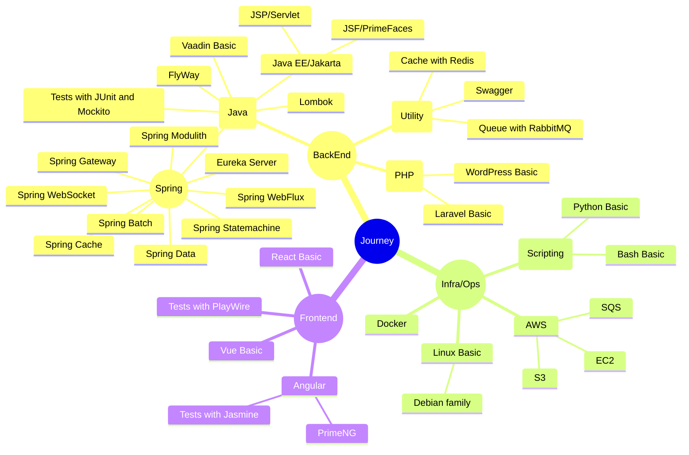

__English__ | [Português](https://github.com/gilberto-009199/gilberto-009199/blob/main/HISTORY_pt_BR.md)

# Journey [under construction]

[2025](#2025) | [2024](#2024) | [2023](#2023) | [2022](#2022) | [2021](#2021) | [2020](#2020) | [2019](#2019) | [2018](#2018) | [2017](#2017) 

<!-- -->

<!-- -->

## 2025

<!--  + Professional Experience:-->
<!--  + My Contributions:-->
 + Activities:
    - [**Challenge BackEnd Anotai**](https://github.com/gilberto-009199/desafio-anotai-backend-aws) - API for a product catalog management system in a marketplace application with S3 and SQS for catalog;
         <small>
                <strong> Spring Boot</strong>
                <strong> Docker</strong>
                <strong> Swagger</strong>
                <strong> MongoDB</strong>
                <strong> AWS</strong>
                <strong> S3 Bucket</strong>
                <strong> SQS </strong>
                <strong> Terraform</strong>
              </small>
    - [**Challenge BackEnd UolHost**](https://github.com/gilberto-009199/desafio-uolhost-backend) - Java application capable of retrieving information from an XML file and a JSON file;
         <small>
                <!-- <strong> Spring Boot</strong> -->
                <strong> Spring Boot</strong>
                <!-- <strong> Docker</strong> -->
                <strong> Docker</strong>
                <strong> Bootstrap</strong> 
              </small>
    - [**Challenge BackEnd Itau**](https://github.com/gilberto-009199/desafio-itau-backend) - REST API that receives Transactions and returns Statistics on those transactions;
         <small>
                <!-- <strong> Spring Boot</strong> -->
                <strong> Spring Boot</strong>
                <!-- <strong> Docker</strong> -->
                <strong> Docker</strong>
                <strong> Swagger</strong>
              </small>

## 2024

 + Academics:
   - Bachelor's degre **Computer Science**
      <small>IMPACTA - "Impacta University" - Barra Funda</small>

<!---+ Professional Experience:-->
 + Projects:
   - [**Computer Graphics in JavaScript**](https://github.com/gilberto-009199/processamento_imagem) - Computer Graphics in Browser Application
     <small>
            <strong> JQuery</strong>
            <strong> JavaScript</strong>
            <strong> Bootstrap</strong>
          </small>

    - [**BigData**](https://github.com/gilberto-009199/bigdata) - BigData and MapReduce
       <small>
            <strong> Scala</strong>
            <strong> Java</strong>
            <strong> Docker</strong>
            <strong> Hadoop</strong>
            <strong> MongoDB</strong>
            <strong> PostgreSQL</strong>
          </small>
    - [**Integrate Assas Payment**](https://github.com/gilberto-009199/assas-php) - Example of integration with asaas to generate payment link.  <small>
            <strong> PHP</strong>
            <strong> Docker</strong>
            <strong> Bootstrap</strong>
            <strong> JQuery</strong>
          </small>
          
<!--   - [**Procesamento**](https://github.com/gilberto-009199/processamento_imagem) - -->

 + Activities:
    - [**Challenge BackEnd PicPay**](https://github.com/gilberto-009199/picpay-desafio-backend) - Simplified payment platform. It allows you to deposit and transfer money between users
     <small>
            <!-- <strong> Spring Boot</strong> -->
            <strong> Spring Boot</strong>
            <!-- <strong> Docker</strong> -->
            <strong> Docker</strong>
            <strong> Swagger</strong>
            <strong> Kafka</strong>
          </small>

## 2023

<!--  + Professional Experience:-->
 + Contributions:
   - [**Backend Install XYZ**](https://github.com/gilberto-009199/como-instalar-xyz) - add tutorial install PostgreSQL in freebsd;
 + Projects:
   - [**Translate Game Terra Invicta**](https://github.com/gilberto-009199/terra-invicta-traducao) - Translate Game Terra Invicta;
   - [**Manager OTP**](https://github.com/gilberto-009199/myauth) - MyAuth, manager token OTP and HOTP, Usando Golang, React e Wails.
     <small>
            <strong> Wails</strong>
            <strong> Go</strong>
            <strong> React</strong>
          </small>

 + Activities:
    - [**Challenge BackEnd Athornatus**](https://github.com/gilberto-009199/desafio-athornatus-backend) - Using Spring boot, create a simple API to manage People;
     <small>
            <strong> Spring Boot</strong>
            <strong> Docker</strong>
            <strong> Swagger</strong>
            <strong> Lombok</strong>
          </small>
   - [**Challenge Library in JSF**](https://github.com/gilberto-009199/bibliotecaJSF) - The objective of this application is to serve as a basis for studying and evaluating the development;
     <small>
            <strong> Docker</strong>
            <strong> Java</strong>
            <strong> Lombok</strong>
            <strong> Tomcat</strong>
            <strong> JSF</strong>
            <strong> PostgreSQL</strong>
          </small>
   
    - [**Backend Example**](https://github.com/Javeiros-brasil/helpmatch-backend) - SpringBoot basic example;
     <small>
            <strong> Spring Boot</strong>
            <strong> PostgreSQL</strong>
            <strong> Lombok</strong>
          </small>

## 2022

<!--  + Professional Experience:-->
 + Projects:
   - [**MyTorrent**](https://github.com/gilberto-009199/MyTorrent) - Torrent client implemented in Java;
     <small>
            <strong> Java</strong>
          </small>

<!-- add https://github.com/gilberto-009199/music -->
<!-- add https://github.com/gilberto-009199/bencode -->
<!-- add https://github.com/gilberto-009199/Estrutura-de-Dados -->

 + Activities:
    - [**Challenge FullStack Jara**](https://github.com/gilberto-009199/avaliacao-full-stack) - Angular Application with SpringBoot;
     <small>
            <strong> Spring Boot</strong>
            <strong> Docker</strong>
            <strong> Angular</strong>
            <strong> PrimeNG</strong>
            <strong> Lombok</strong>
          </small>

## 2021

<!--  + Professional Experience:-->
 + Contributions:
    - [**AspenFlorest**](https://github.com/AspenX-Community/AspenFlorest) - Browser Game;
     <small>
            <strong> VUE</strong>
            <strong> JavaScript</strong>
            <strong> ThreeJS</strong>
          </small>

 + Projects:
   - [**MyOS**](https://github.com/gilberto-009199/MyOS) - Worspace para criar um Sistema Operacional;
   - [**Login Cryto Wallet Vue**](https://github.com/gilberto-009199/Login-Cripto-Wallet-Vue) - Login Cryto Wallet Vue;
     <small>
            <strong> Docker</strong>
            <strong> MetaMask</strong>
            <strong> VUE</strong>
          </small>

 + Activities:
   - [**Site of AspenFlorest**](https://github.com/gilberto-009199/AspenX) - AspenX site cryptocurrency.
     <small>
            <strong> Docker</strong>
            <strong> Bootstrap</strong>
            <strong> JQuery</strong>
          </small>

## 2020

<!--  + Professional Experience:-->
 + Projects:
   - [**Game in java**](https://github.com/gilberto-009199/mondoj) - Game 3d basic in LibGDX
     <small>
            <strong> Java</strong>
            <strong></strong>
          </small>

 + Activities:
   - [**Http Server in C++**](https://github.com/gilberto-009199/http-server-cpp) - Http server implemented in C++;
     <small>
            <strong> C++</strong>
          </small>

   - [**My Script for bot in Screeps**](https://github.com/gilberto-009199/MyScreeps) - Code for manager Bot Screeps Game;
     <small>
            <strong> JavaScript</strong>
          </small>

   - [**Academia Desktop System**](https://github.com/gilberto-009199/JAcademia) - Academia Desktop System Swing 
     <small>
            <strong> Java</strong>
            <strong> Access</strong>
          </small>

   - [**Desktop Contact Book**](https://github.com/gilberto-009199/JAgenda) - Desktop Contact Book Swing 
     <small>
            <strong> Java</strong>
            <strong> Access</strong>
          </small>

   - [**Contact Book in JSP**](https://github.com/gilberto-009199/JAgendaWeb) - Web contact book made with JSP, Bootstrap and Jquery;
     <small>
            <strong> Docker</strong>
            <strong> Servlets</strong>
            <strong> Tomcat</strong>
            <strong> Bootstrap</strong>
            <strong> JQuery</strong>
          </small>

## 2019

+ Academics:
   -  Technical degree **Developer**(2017-2019)
      <small>SENAI - "Prof. Vicente Amato" - Jandira</small>
<!--  + Professional Experience:-->
<!--  + My Contributions: -->
 + Contributions:
   - [**Mobshare TCC PHP**](https://github.com/gilberto-009199/mobshare) - Mobshare tcc Site for developer SENAI.
     <small>
            <strong> PHP</strong>
            <strong> Docker</strong>
            <strong> MariaDB</strong>
            <strong> JQuery</strong>
          </small>
   - [**Mobshare TCC Desktop**](https://github.com/gilberto-009199/MobShareDesktop) - Mobshare tcc Desktop for developer SENAI.
     <small>
            <strong> Electron</strong>
            <strong> JQuery UI</strong>
            <strong> JQuery</strong>
          </small>

## 2018

<!--  + Professional Experience:-->
<!--  + My Contributions: -->
 + Activities:
   - [**Manager NewsStands**](https://github.com/gilberto-009199/BugsBonny) - Newspaper Stand Manager.
     <small>
            <strong> PHP</strong>
            <strong> Docker</strong>
            <strong> MariaDB</strong>
            <strong> JQuery</strong>
            <strong> Vue</strong>
          </small>
   - [**Hangman Game on Mobile**](https://github.com/gilberto-009199/jogo-forca-mobile) - Hangman Game on Mobile, draw words randomly.
     <small>
            <strong> Java</strong>
            <strong> Android</strong>
          </small>
   - [**Mobile Book Manager**](https://github.com/gilberto-009199/MyBooks) - Mobile Book Manager, crud books.
     <small>
            <strong> Java</strong>
            <strong> Android</strong>
          </small>

## 2017

 + Academics:
   - Technical degree **Computer Networks**(2015-2017)
      <small>ITB - "Barueri Technical Institute" - Barueri</small>
<!--  + Professional Experience:-->
 + Projects:
   - [**Ping Broadcast**](https://github.com/gilberto-009199/ping) -  Ping Broadcast in visual basic.
     <small>
            <strong> Visual Basic</strong>
          </small>
<!-- + Github Activities: -->

## initial 

