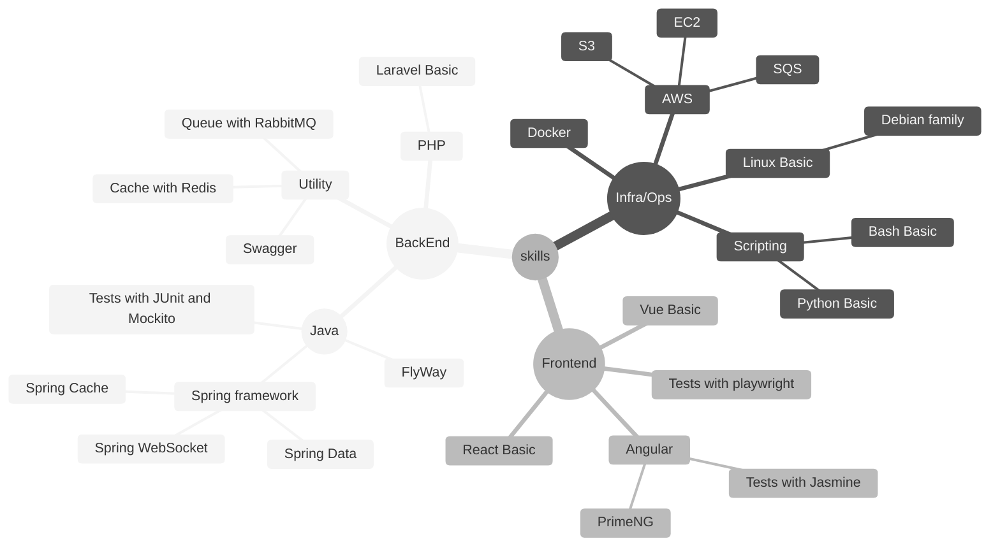

[English](HISTORY.md) | __Português__

# Jornada

[2025](#2025) | [2024](#2024) | [2023](#2023) | [2022](#2022) | [2021](#2021) | [2020](#2020) | [2019](#2019) | [2018](#2018) | [2017](#2017) 

## 2025

<!--  + Professional Experience:-->
<!--  + My Contributions:-->

+ Atividades Academicas:
   - Bacharelado em  **Ciência da Computação**(2020-2025....)
      <small>IMPACTA - "Impacta University" - Barra Funda</small>

 + Atividades do Github:
   - [**Code Editor**](https://github.com/gilberto-009199/CodeEditor) - Editor e Executador portátil para JavaScript e Python. Desenvolvido com GraalVM Polyglot e JavaFX;
         <small>
                <strong> GraalVM Polyglot</strong>
                <strong> JavaScript</strong>
                <strong> Python</strong>
              </small>
    - [**Desafio BackEnd Anotai**](https://github.com/gilberto-009199/desafio-anotai-backend-aws) - API para um sistema de gerenciamento de catálogo de produtos em um aplicativo de marketplace com S3 e SQS para catálogo;
         <small>
                <strong> Spring Boot</strong>
                <strong> Docker</strong>
                <strong> Swagger</strong>
                <strong> MongoDB</strong>
                <strong> AWS</strong>
                <strong> S3 Bucket</strong>
                <strong> SQS </strong>
                <strong> Terraform</strong>
              </small>
    - [**Desafio BackEnd UolHost**](https://github.com/gilberto-009199/desafio-uolhost-backend) - Aplicação Java capaz de recuperar informações de um arquivo XML e um arquivo JSON;
         <small>
                <!-- <strong> Spring Boot</strong> -->
                <strong> Spring Boot</strong>
                <!-- <strong> Docker</strong> -->
                <strong> Docker</strong>
                <strong> Bootstrap</strong> 
              </small>
    - [**Desafio BackEnd Itau**](https://github.com/gilberto-009199/desafio-itau-backend) - API REST que recebe Transações e retorna Estatísticas sobre essas transações;
         <small>
                <!-- <strong> Spring Boot</strong> -->
                <strong> Spring Boot</strong>
                <!-- <strong> Docker</strong> -->
                <strong> Docker</strong>
                <strong> Swagger</strong>
              </small>

## 2024

<!---+ Professional Experience:-->
 + Atividades do Github:
   - [**Computação Grafica com JS no Browser**](https://github.com/gilberto-009199/processamento_imagem) - Aplicação de Computação Gráfica no Navegador
     <small>
            <strong> JQuery</strong>
            <strong> JavaScript</strong>
            <strong> Bootstrap</strong>
          </small>

    - [**BigData**](https://github.com/gilberto-009199/bigdata) - BigData e MapReduce
       <small>
            <strong> Scala</strong>
            <strong> Java</strong>
            <strong> Docker</strong>
            <strong> Hadoop</strong>
            <strong> MongoDB</strong>
            <strong> PostgreSQL</strong>
          </small>
    - [**Integração de pagamento com Assas**](https://github.com/gilberto-009199/assas-php) - Exemplo de integração com asaas para gerar link de pagamento.  <small>
            <strong> PHP</strong>
            <strong> Docker</strong>
            <strong> Bootstrap</strong>
            <strong> JQuery</strong>
          </small>
    - [**Desafio BackEnd PicPay**](https://github.com/gilberto-009199/picpay-desafio-backend) - Plataforma de pagamento simplificada. Permite depositar e transferir dinheiro entre usuários
     <small>
            <!-- <strong> Spring Boot</strong> -->
            <strong> Spring Boot</strong>
            <!-- <strong> Docker</strong> -->
            <strong> Docker</strong>
            <strong> Swagger</strong>
            <strong> Kafka</strong>
          </small>

## 2023

<!--  + Professional Experience:-->
 + Atividades do Github:
   - [**Backend Install XYZ**](https://github.com/gilberto-009199/como-instalar-xyz) - adicionar tutorial instalar PostgreSQL no freebsd;
   - [**Traduzir Jogo Terra Invicta**](https://github.com/gilberto-009199/terra-invicta-traducao) - Traduzir Jogo Terra Invicta;
    <small>
            <strong> Translate</strong>
          </small>

   - [**Traduzir Jogo Mount Blade: Warband**](https://github.com/gilberto-009199/Mount-and-blade-warband-tradu-o) - Traduzir Jogo Mount and Blade: Warband;
    <small>
            <strong> Translate</strong>
          </small>
   - [**Gerenciador de OTP**](https://github.com/gilberto-009199/myauth) - MyAuth, gerenciador de token OTP e HOTP, Usando Golang, React e Wails.
     <small>
            <strong> Wails</strong>
            <strong> Go</strong>
            <strong> React</strong>
          </small>
    - [**Desafio BackEnd Athornatus**](https://github.com/gilberto-009199/desafio-athornatus-backend) - Usando Spring boot, criar uma API simples para gerenciar Pessoas;
     <small>
            <strong> Spring Boot</strong>
            <strong> Docker</strong>
            <strong> Swagger</strong>
            <strong> Lombok</strong>
          </small>
   - [**Desafio Library in JSF**](https://github.com/gilberto-009199/bibliotecaJSF) - O objetivo desta aplicação é servir como base para estudo e avaliação do desenvolvimento;
     <small>
            <strong> Docker</strong>
            <strong> Java</strong>
            <strong> Lombok</strong>
            <strong> Tomcat</strong>
            <strong> JSF</strong>
            <strong> PostgreSQL</strong>
          </small>
   
    - [**Backend Example Para a Javeiros Brasil**](https://github.com/Javeiros-brasil/helpmatch-backend) - Exemplo básico de SpringBoot para a comunidade Javeiros Brasil;
     <small>
            <strong> Spring Boot</strong>
            <strong> PostgreSQL</strong>
            <strong> Lombok</strong>
          </small>

## 2022

<!--  + Professional Experience:-->
 + Atividades do Github:
   - [**MyTorrent**](https://github.com/gilberto-009199/MyTorrent) - Cliente Torrent implementado em Java;
     <small>
            <strong> Java</strong>
          </small>
   - [**Desafio FullStack Jara**](https://github.com/gilberto-009199/avaliacao-full-stack) - Aplicação Angular com SpringBoot;
     <small>
            <strong> Spring Boot</strong>
            <strong> Docker</strong>
            <strong> Angular</strong>
            <strong> PrimeNG</strong>
            <strong> Lombok</strong>
          </small>

## 2021

<!--  + Professional Experience:-->
 + Atividades do Github:
    - [**AspenFlorest**](https://github.com/AspenX-Community/AspenFlorest) - Jogo de Navegador;
     <small>
            <strong> VUE</strong>
            <strong> JavaScript</strong>
            <strong> ThreeJS</strong>
          </small>
   - [**Caramelo OS**](https://github.com/gilberto-009199/caramelo-OS) - Caramelo OS, distro meme;
   - [**Login Cryto Wallet Vue com Nuxt**](https://github.com/gilberto-009199/Login-Cripto-Wallet-Vue) - Login Cryto Wallet Vue;
     <small>
            <strong> Docker</strong>
            <strong> MetaMask</strong>
            <strong> VUE</strong>
          </small>
   - [**Site da AspenFlorest**](https://github.com/gilberto-009199/AspenX) - Site AspenX criptomoeda.
     <small>
            <strong> Docker</strong>
            <strong> Bootstrap</strong>
            <strong> JQuery</strong>
          </small>

## 2020

<!--  + Professional Experience:-->
 + Atividades do Github:
   - [**Jogo em java**](https://github.com/gilberto-009199/mondoj) - Jogo 3d básico em LibGDX
     <small>
            <strong> Java</strong>
            <strong></strong>
          </small>
   - [**Http Server em C++**](https://github.com/gilberto-009199/http-server-cpp) - Servidor Http implementado em C++;
     <small>
            <strong> C++</strong>
          </small>

   - [**My Script for bot in Screeps**](https://github.com/gilberto-009199/MyScreeps) - Código para gerenciar Bot Screeps Game;
     <small>
            <strong> JavaScript</strong>
          </small>

   - [**Academia Desktop System**](https://github.com/gilberto-009199/JAcademia) -  Sistema Desktop Academia Swing
     <small>
            <strong> Java</strong>
            <strong> Access</strong>
          </small>

   - [**Crud de Contatos**](https://github.com/gilberto-009199/JAgenda) - Agenda de Contatos Desktop Swing
     <small>
            <strong> Java</strong>
            <strong> Access</strong>
          </small>

   - [**Crud de Contatos em JSP**](https://github.com/gilberto-009199/JAgendaWeb) -  Agenda de contatos web feita com JSP, Bootstrap e Jquery;
     <small>
            <strong> Docker</strong>
            <strong> Servlets</strong>
            <strong> Tomcat</strong>
            <strong> Bootstrap</strong>
            <strong> JQuery</strong>
          </small>

## 2019

+ Atividades Academicas:
   -  Tecnico em **Desenvolvimento de Sistemas**(2017-2019)
      <small>SENAI - "Prof. Vicente Amato" - Jandira</small>
<!--  + Professional Experience:-->
 + Atividades do Github:
   - [**Mobshare TCC PHP**](https://github.com/gilberto-009199/mobshare) - Mobshare tcc Site para desenvolvedor SENAI.
     <small>
            <strong> PHP</strong>
            <strong> Docker</strong>
            <strong> MariaDB</strong>
            <strong> JQuery</strong>
          </small>
   - [**Mobshare TCC Desktop**](https://github.com/gilberto-009199/MobShareDesktop) - Mobshare tcc Desktop para desenvolvedor SENAI.
     <small>
            <strong> Electron</strong>
            <strong> JQuery UI</strong>
            <strong> JQuery</strong>
          </small>

## 2018

 + Atividades do Github:
   - [**Site para Bancas de Jornal**](https://github.com/gilberto-009199/BugsBonny) - Gerenciador de Banca de Jornais.
     <small>
            <strong> PHP</strong>
            <strong> Docker</strong>
            <strong> MariaDB</strong>
            <strong> JQuery</strong>
            <strong> Vue</strong>
          </small>
   - [**Jogo da Forca em Mobile**](https://github.com/gilberto-009199/jogo-forca-mobile) - Jogo da Forca no Mobile, desenha palavras aleatoriamente.
     <small>
            <strong> Java</strong>
            <strong> Android</strong>
          </small>
   - [**Crud de Livros em Mobile**](https://github.com/gilberto-009199/MyBooks) - Gerenciador de Livros Mobile, crud de livros.
     <small>
            <strong> Java</strong>
            <strong> Android</strong>
          </small>

## 2017

 + Atividades Academicas:
   - Curso Técnico **Redes de Computadores**(2015-2017)
      <small>ITB - "Instituto Tecnico de Barueri" - Barueri</small>
<!--  + Professional Experience:-->
 + Atividades do Github:
   - [**SmartNetwork TCC**](https://github.com/gilberto-009199/lab-tcc) - Lab. TCC de Call Center em GNS3.
     <small>
            <strong>Squid</strong>
            <strong>Asterisk</strong>
            <strong>Samba</strong>
            <strong>Bacula</strong>
            <strong>Zabbix</strong>
          </small>
   - [**Ping Broadcast**](https://github.com/gilberto-009199/ping) -  Ping Broadcast em visual basic, utilitario para administradores de redes.
     <small>
            <strong> Visual Basic</strong>
          </small>

